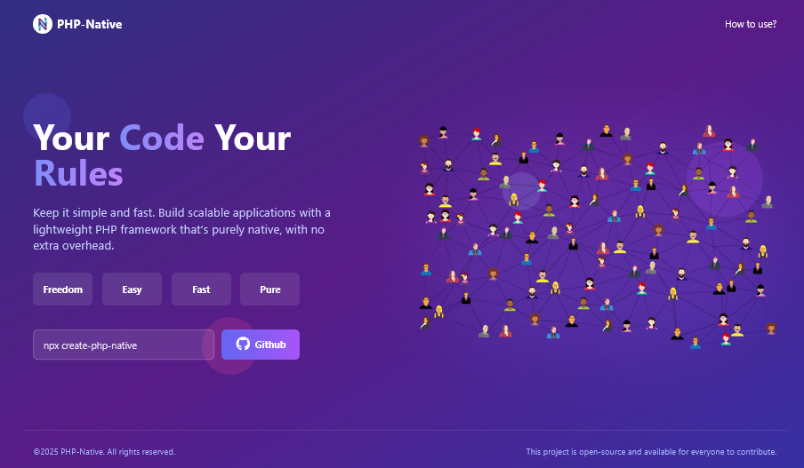

# PHP-Native

Keep it simple and fast. Build scalable applications with a lightweight PHP framework that’s purely native, with no extra overhead. 

### Getting Variants

```bash
npx create-php-native
```



### Folder Structure

```bash
php/
│── app/
│   ├── Controllers/
│   │    ├── Api/
│   │    │    ├── WelcomeController.php
│   │    ├── Error404Controller.php
│   │    ├── ErrorController.php
│   │    ├── HomeController.php
│   │
│   ├── Middleware/
│   │    ├── ApiKeyMiddleware.php
│   │
│   ├── Models/
│   │    ├── ExampleData.php
│   │
│   ├── Routes/
│   │    ├── web.php
│   │    ├── api.php
│   │
│   ├── Views/
│        ├── layouts/
│        │    ├── main.php
│        ├── partials/
│        │    ├── header.php
│        │    ├── footer.php
│        ├── pages/
│             ├── 404.php
│             ├── error.php
│             ├── home.php
│── config/
│   ├── config.php
│
│── core/
│   ├── Controller.php
│   ├── Cors.php
│   ├── Database.php
│   ├── Model.php
│   ├── Router.php
│   ├── Security.php
│
│── public/
│   ├── images/
│   ├── css/
│   ├── js/
│   ├── .htaccess
│   ├── index.php
│
│── vendor/
│
│── .env 
│── .htaccess
│── composer.json
│── README.md
```

### Example Get Data

```php
// Display data
use Core\Database;

public function Example() {
  $data = Database::fetchAll("SELECT * FROM table_name");
  return $this->view('pages/home', 
  [
    'data' => $data, 
    'title' => 'Example Pages'
  ]);
}
```

### Example Get By ID Data

```php
use Core\Database;

public function example($id) {
  $data = Database::fetch("SELECT * FROM table_name WHERE id = :id", ['id' => $id]);
  if (!$data) {
    header("Location: /error");
    exit;
  }
  return $this->view('pages/home', [
    'data' => $data,
    'title' => 'Example Page'
  ]);
}
```

### Example Adding Data

```php
use Core\Database;

public function Example() {
  if ($_SERVER['REQUEST_METHOD'] === 'POST' && !empty($_POST['form_column_name'])) {
    Database::execute("INSERT INTO table_name (column_name) VALUES (:column_name)", 
    [
    'column_name' => htmlspecialchars(trim($_POST['form_column_name']))
    ]);
  }
  header("Location: /");
  exit;
}
```

### Example Edit Data

```php
use Core\Database;

public function update($id) {
  if ($_SERVER['REQUEST_METHOD'] !== 'POST') {
    return;
  }
  Database::execute("UPDATE table_name SET column_name = :column_name WHERE id = :id", 
  [
    'column_name' => htmlspecialchars(trim($_POST['form_column_name'])),
    'id' => $id
  ]);
  header("Location: /");
  exit;
}
```

### Example Delete Data

```php
use Core\Database;

public function delete($id) {
  Database::execute("DELETE FROM table_name WHERE id = :id", ['id' => $id]);
  header("Location: /");
  exit;
}
```

### Generate & Verification CSRF Input (View)

```php
// Generate in Form
<?php use Core\Security; ?>
...
<input type="hidden" name="csrf_token" value="<?= Security::generateCsrfToken() ?>">
...

// Verification in Controller
use Core\Security;
...
if ($_SERVER["REQUEST_METHOD"] !== "POST" || !Security::verifyCsrfToken($_POST['csrf_token'] ?? '')) {
  $_SESSION['error'] = "Invalid CSRF Token!";
  header("Location: /error");
  exit;
}
...
```

### Enable Secure Input (Controller)

```php
use Core\Security;
...
'column_name' => trim(Security::sanitize($_POST['form_column_name'])),
...
```

### Disable display layout, add 'false' to disable layout usage

```php
return $this->view('pages/home', 
  [
    'title' => 'Home'
  ], false);
```

### Set up a database connection in /config/config.php

```php
'db' => [
  'host' => 'localhost',
  'dbname' => 'demo',
  'user' => 'root',
  'pass' => ''
],
```

### Change api key (http://localhost:8000/v1?api-key=) in /config/config.php

```php
'api' => [
  'api_key' => 'example-api-key-here',
]
```

### Manage Additional Security in /config/config.php

```php
'security' => [
  'csrf_protection' => true,
  'session_security' => true,
  'rate_limiting' => true,
  'security_headers' => true,
  'headers' => [
    'X-Frame-Options'            => 'DENY',
    'X-XSS-Protection'           => '1; mode=block',
    'X-Content-Type-Options'     => 'nosniff',
    'Referrer-Policy'            => 'no-referrer-when-downgrade',
    'Strict-Transport-Security'  => 'max-age=31536000; includeSubDomains; preload',
  ],
],
```
